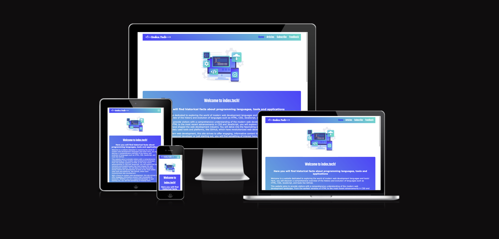

# Index.Tech website
<a href="https://humberto-pereira.github.io/index.tech/">View the live project here.</a>

# User Experience (UX)

- As a first-time Visitor, I want to know What the site is about and be able to navigate through the content easily.
- As a first-time Visitor, I want to find relevant content to the site's theme and my needs.
- As a first-time Visitor, I want a nice layout with compelling images, colors, and good contrast between the text and background.
- As a returning Visitor, I want to find new content and the possibility to share relevant posts on social media.
- As a frequent user, I want to subscribe to Newsletter to be updated on new posts and general info.

## DESIGN:

- Color scheme: The color scheme is white and two shades of blue that fit with the image graphics chosen for the website with enough contrast for the user. 
- Typography: Teko is used for titles and footer;  Verdana is the most used in all text content and is easy to read and formal; the Geneva, Tahoma, and sans-serif are the backup fonts.
- Imagery: good resolution images "not pixeled" with connection with the content.

## Thematic: Programming languages and tools; historical facts evolution and implementation.

## Technologies:
- HTML, CSS and JavaScript
## Frameworks, Libraries & Programs Used
- 

### WebSite map
- Menubar: Home, Articles, Subscribe, Feedback 
- Home: Landing page: Logo, PC related graphics a brief text welcoming the user and describing the webpage, under the welcome text, four clickable Article cards and a footer.
- Articles: Link to Articles cards.
- Article Cards: Each Article card redirects to a specific article.
- Subscribe: Subscribe For Receive New Posts Updates Per E-mail page.      
- Feedback: Feedback form page.
- 404 error page
- Burger menu for mobile.

# WIREFRAMES

# Home

# Example of a Post Content Page
 

 
# Subscribe

# Feedback

# Mobile

# IMPLEMENTATION / CODING
- Well-organized and structured HTML, and CSS code.

# TESTING:
- Manual testing checks if all links work as expected, with no bugs, test different screen sizes, test at the W3C validator, test at the CSS official (Jigsaw) validator, and test the accessibility Lighthouse Chrome dev tools.

# DEPLOYMENT:
- GitHub, GitHub – pages.

# MAINTENANCE:
- Maximise future maintainability through documentation, code structure, and organization.

