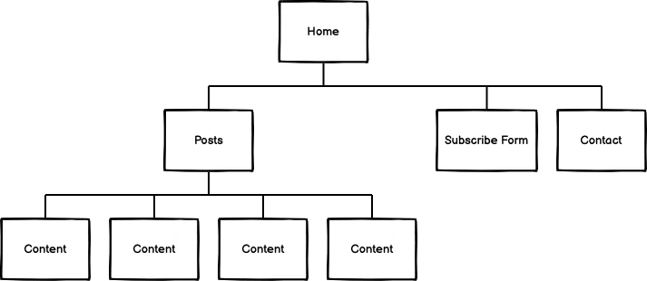
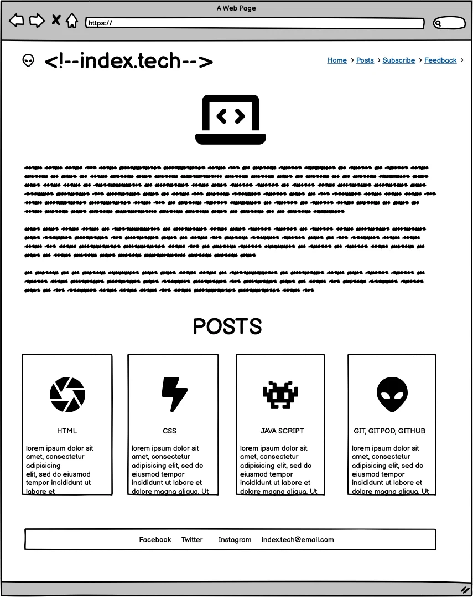
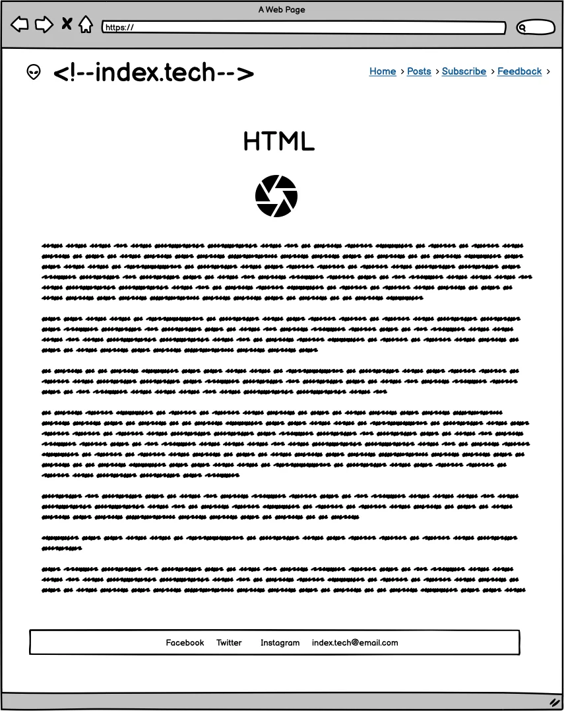
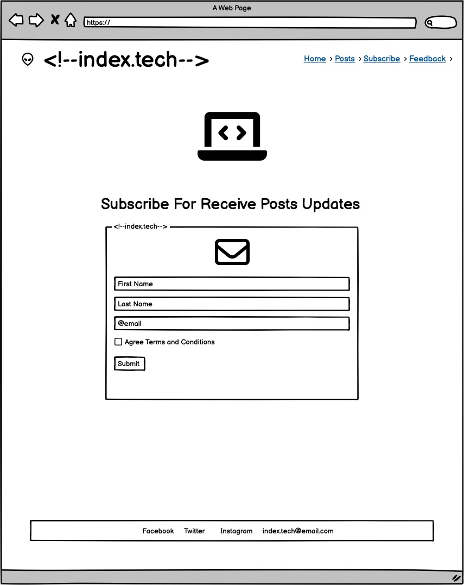

# PP1 SDLC Humberto Pereira

# User Experience (UX)

- As a first-time Visitor, I want to know What the site is about and be able to navigate through the content easily.
- As a first-time Visitor, I want to find relevant content to the site's theme and my needs.
- As a first-time Visitor, I want a nice layout with compelling images, colors, and good contrast between the text and background.
- As a returning Visitor, I want to find new content and the possibility to share relevant posts on social media.
- As a frequent user, I want to subscribe to Newsletter to be updated on new posts and general info.

## DESIGN:

- Color scheme: still being chosen. Want to try different patterns. ? 
- Typography: still being chosen. Want to try different fonts. ?
- Imagery: good resolution images "not pixeled" with connection with the content.

## Thematic: Programming languages and tools; historical facts evolution and implementation.

## Technologies: HTML CSS.

### WebSite map
- Menu: HOME, BLOG, SUBSCRIBE, CONTACT 
- HOME: Landing page; logo, a brief text welcoming the user and describing the webpage, under the welcome text, four clickable blog cards. 
- Posts: Link to Post cards.
- SUBSCRIBE form page.      
- CONTACT: redirect to footer with contact info. All pages follow the same style and color pattern and a footer. 
- 404 error page
- Burger menu for mobile.

# WIREFRAMES

# Home

# Example of a Post Content Page
 

 
# Subscribe

# Contact

# Mobile

# IMPLEMENTATION / CODING
- Well-organized and structured HTML, and CSS code.

# TESTING:
- Manual testing checks if all links work as expected, with no bugs, test different screen sizes, test at the W3C validator, test at the CSS official (Jigsaw) validator, and test the accessibility Lighthouse Chrome dev tools.

# DEPLOYMENT:
- GitHub, GitHub – pages.

# MAINTENANCE:
- Maximise future maintainability through documentation, code structure, and organization.

