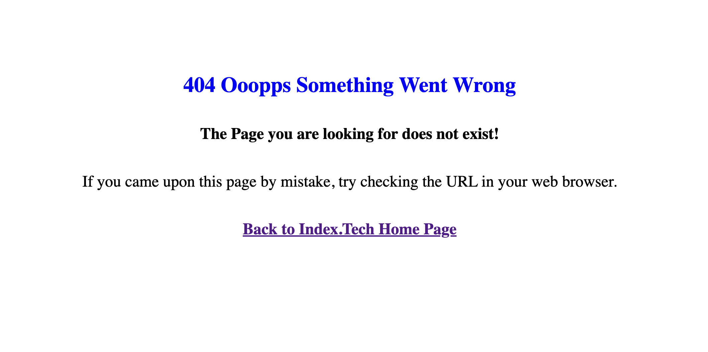
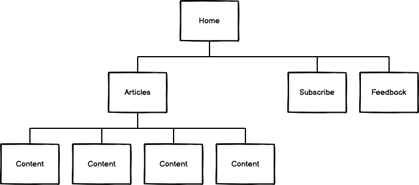

# Index.Tech website

Index.Tech is a website dedicated to exploring the world of modern web development languages and tools! The website hopes to comprehensively overview the history and evolution of languages like HTML, CSS, JavaScript, and tools like GitHub. Index.Tech will give an overview of the historical facts and development of some web dev languages and tools to the user and is intended to target students and users that are curious about the theme's historical facts and its evolution through time; at the end of each article is provided a tutorial link to the users if they wish to learn more about the article thematic.   
<a href=" https://humberto-pereira.github.io/indextech/">View the live project here.</a>

 
 

# Landing Page

The landing page will be divided into six sections below this document: Navigation Bar, Hamburger Menu, images, Welcome Text, Cards, and Footer.

 
 

# Navigation Bar
The navigation bar on all seven pages includes links to the Logo, Home, Articles Cards, Subscribe, and Feedback and is set fixed; it is identical on each page for intuitive navigation with no need for the browser back button utilization.

 
 

# Hamburger menu
The Hamburger menu on the right side of the menu bar is present on all seven pages on tablets and smartphones, giving more space and usability to the menu bar on smaller screens with less space.

 
 

# images

A primary image is displayed on the Home, Subscribe, and Feedback pages; it matches the page's theme, style, and colors. 

## Additionally, there are four different images for each of the Article's cards and pages, each featuring the logo of the language or tool discussed in the Article, as shown below in the "Article Cards" section.

 
 

# Welcome text

The purpose of the welcome text is to introduce users to the theme and content of the webpage in a clear and engaging way. Our goal is to spark their curiosity and share our passion for this exciting field.

# Article Cards

The Article cards display the logo of the programming language or tools discussed in the article. Additionally, a scrollbar was implemented, and the message "click to continue reading" displays at the end of the first paragraph. Also, it changes the color to another shade of white when hovered to indicate that the card is clickable. The cards were created to give users a preview of the content and entice them to read more. To access the full article, users can click anywhere on the card.

 
 

# Footer

The website's footer includes links to the four leading social media platforms and an email address for contact. Clicking on any of these links will open them in a new tab, allowing the user to continue browsing the Index.Tech page. The footer is useful for users to stay connected through social media.

# Articles

All four of the Article pages have the same style, which is simple and easy to understand. Each page has the logo of the language or tool at the top of the title, and the article text is below. When you click on an Article in the menu, it takes you to the article cards section on the home landing page. To read the article, simply click on the article card.

# Subscribe

On the subscribe page, you will find a form that requires you to fill in three input fields: first name, last name, and email. Additionally, there is a checkbox for terms and conditions. The content of the terms and conditions is scrollable so the user can read it easily. The form's purpose is to the user subscribe to a newsletter and receive new posts via email.

# Feedback

To submit feedback, users can fill out a form with their first name, last name, and email. They can then provide their input in a text box. This feedback page is designed to collect suggestions for new articles and positive or negative feedback. The developer can then use this information to improve the website based on user input.

# 404 page
If The user encounter a 404 error, this page will show an error message that suggests checking the URL in your web browser if you arrived here accidentally. Additionally, it provides a link to return to the Index.Thec Home Page.

# Testing

- Manual testing was conducted on several browsers, including Safari, Edge, Chrome, Firefox, and Chrome dev tools devices sizes. 
- During testing, we checked that all Menubar links and Cards Articles were displayed and behaved as expected when clicked, and all texts were displayed correctly. 
- It was also confirmed that the landing page Article cards display and resize evenly on all display sizes, and the scrollable text works flawlessly.
- All four Articles are displayed as expected with no issues.
- All footer links open in a new browser tab, similar to Article tutorial links. Additionally, it was ensured that the all images, and texts were displayed without any issues. 
- On the Subscribe page, the form requires all input fields to be filled, a valid email, and the Terms and Conditions checkbox to be selected. 
- It was also confirmed that the scroll function for Terms and Conditions worked as expected, and the form was submitted without problems. 
- The Feedback page is displayed as expected all input fields are required to be filled, and a valid email format is necessary before submitting; feedback submission also works as expected.
- On Smartphone and tablet screens, the site is fully responsive on all pages, including a hamburger menu that works flawlessly.
- When an error occurs, the 404 error is displayed and includes a link to the website's home page tha works with no issues.

## Bugs
- The article cards had sizing issues on smaller screens due to the different lengths of the snippet text words. This caused the cards to have varying heights and some flex-box cards to resize unevenly, resulting in text overflow on smaller screens. Despite trying various solutions, none worked until a scrollbar was added to the text container. This fixed the issue, resulting in uniform card height across all screen sizes and no text overflow. The bug has been fixed.

- The VS Code Prettier extension had added trailing slashes, which resulted in a warning message at the W3C validator. However, the issue has been resolved.

# Validator Testing

## W3C HTML Validator Links

- <a href="https://validator.w3.org/nu/?doc=https%3A%2F%2Fhumberto-pereira.github.io%2Findextech%2F">Home Landing Page:</a>

- <a href="https://validator.w3.org/nu/?doc=https%3A%2F%2Fhumberto-pereira.github.io%2Findextech%2Fsubscribe.html">Subscribe Page: </a>

- <a href="https://validator.w3.org/nu/?doc=https%3A%2F%2Fhumberto-pereira.github.io%2Findextech%2Ffeedback.html">Feedback Page:</a>

- <a href="https://validator.w3.org/nu/?doc=https%3A%2F%2Fhumberto-pereira.github.io%2Findextech%2Fhtml-article.html">HTML Article Page:</a>

- <a href="https://validator.w3.org/nu/?doc=https%3A%2F%2Fhumberto-pereira.github.io%2Findextech%2Fcss-article.html">CSS Article Page:</a>

- <a href="https://validator.w3.org/nu/?doc=https%3A%2F%2Fhumberto-pereira.github.io%2Findextech%2Fjavascript-article.html">JavaScript Article Page:</a>

- <a href="https://validator.w3.org/nu/?doc=https%3A%2F%2Fhumberto-pereira.github.io%2Findextech%2Fgithub-article.html">GitHub Article Page:</a>

- Screenshot of 404.html W3C Validator by direct input
- 

## W3C Css Validator Jigsaw

- <a href="https://jigsaw.w3.org/css-validator/validator?uri=https%3A%2F%2Fhumberto-pereira.github.io%2Findextech%2F&profile=css3svg&usermedium=all&warning=1&vextwarning=&lang=pt-BR">W3C CSS Validator Jigsaw</a>

## chrome Lighthouse Screenshots

## desktop:

## mobile:

# Deployment

## To deploy your repository, follow these steps: 
- 1. Select the desired repository to be deployed
- 2. Click on Settings. 
- 3. Select Pages from the left side menu. 
- 4. In the Source option, choose "Deploy from a branch." 
- 5. At the Branch option, select Main; and ensure the root file is also chosen. 
- 6. Click on Save. 
- 7. Wait for a few seconds, then refresh the page. Your deployed page will be live, and your webpage link will be displayed.

## - The live link can be found here:
## <a href=" https://humberto-pereira.github.io/indextech/">Index.Tech live link </a>

# There aren't any known unfixed bugs

# Credits

## Code:
- Hamburger menu: Html, CSS and JavaScript was taken from youtube channel Web Dev Simplified Tutorial - <a href="https://www.youtube.com/watch?v=At4B7A4GOPg&list=PLUNoBnR80iZC4QtWXaoi8hj9rMHcI9rAQ&index=9&ab_channel=WebDevSimplified">Responsive Navbar Tutorial</a>
- Navbar HTML was based on the Code Institute Love Running "Navigation style" lessons - <a href="https://www.youtube.com/watch?v=At4B7A4GOPg&list=PLUNoBnR80iZC4QtWXaoi8hj9rMHcI9rAQ&index=9&ab_channel=WebDevSimplified">"Navigation style" lessons</a>
- Subscribe Form was based on the Code Institute Love Running  - <a href="https://learn.codeinstitute.net/courses/course-v1:CodeInstitute+HE101+2020/courseware/fcc67a894619420399970ae84fc4802f/643317b091da4eef98fe9e0812a71715/">"Signup Form: Challenge 2"</a>
- Feedback form HTML was based on the Code Institute - <a href="https://learn.codeinstitute.net/courses/course-v1:CodeInstitute+HE101+2020/courseware/fcc67a894619420399970ae84fc4802f/643317b091da4eef98fe9e0812a71715/">"The textarea Challenge"</a>
- All CSS flex box code was learned at W3 Schools - <a href="https://www.w3schools.com/css/css3_flexbox.asp">"CSS Flexbox Tutorial"</a>
- The Terms and Conditions scrollbar was learned at - <a href="https://www.w3schools.com/howto/howto_css_custom_scrollbar.asp">W3 Schools How to custom scrollbar tutorial</a>
- Favicon HTML snippet taken from - <a href="https://www.w3schools.com/html/html_favicon.asp">w3 Schools</a>

# Media
## Images
- The hero image on Landing Page "Home," "Subscribe," and  "Feedback" source is  - <a href="https://www.freepik.com/free-vector/desktop-smartphone-app-development_10276838.htm#&position=5&from_view=collections">Freepik</a>
- Articles Images, and Subscribe envelope image source is - <a href="https://www.pngegg.com/">PNGEgg</a>
- Footer icons source is - <a href="https://fontawesome.com/">Font Awesome</a>
- Favicon image source is - <a href="https://favicon.io/favicon-generator/">Favicon.io</a>
- Index.Tech Logo was created with the Canva app. 
## Articles
- All Articles, Welcome "Home" text and Terms and Conditions were written by <a href="https://openai.com/blog/chatgpt">ChatGPT OPEN AI</a>
## Fonts
- The Teko font source is - <a href="https://fonts.google.com/">Google Fonts</a>

# User Experience (UX)

- As a first-time Visitor, I want to know What the site is about and be able to navigate through the content easily.
- As a first-time Visitor, I want to find relevant content to the site's theme and my needs.
- As a first-time Visitor, I want a nice layout with compelling images, colors, and good contrast between the text and background.
- As a returning Visitor, I want to find new content and the possibility to share relevant posts on social media.
- As a frequent user, I want to subscribe to Newsletter to be updated on new posts and general info.

## DESIGN:

-The website's color scheme consists of a gradient of two shades of blue and white, which complements the chosen image graphics and provides sufficient contrast for the user. 
-For titles and footer, the font used is Teko, while Verdana is the preferred font for all text content as it is easy to read. In case of any font compatibility issues, Geneva, Tahoma, and sans-serif are the backup fonts.
- The website uses high-quality images that are relevant to the content and have good resolution without any pixelation.

## Thematic: Programming languages and tools; historical facts evolution and implementation.

## Technologies:

- HTML, CSS and JavaScript.

## Frameworks, Libraries & Application Used:

- Balsamiq app, VS Studio code.

### WebSite map
- Menubar: Home, Articles, Subscribe, Feedback 
- Home: Landing page: Logo, PC related graphics a brief text welcoming the user and describing the webpage, under the welcome text, four clickable Article cards and a footer.
- Articles: Link to Articles cards.
- Article Cards: Each Article card redirects to a specific article.
- Subscribe: Subscribe For Receive New Posts Updates Per E-mail page.      
- Feedback: Feedback form page.
- 404 error page
- Burger menu for mobile.

# WIREFRAMES

# Home

# Example of a Post Content Page
 

 
# Subscribe

# Feedback

# Mobile

# IMPLEMENTATION / CODING
- Well-organized and structured HTML, and CSS code.

# TESTING:
- Manual testing checks if all links work as expected, with no bugs, test different screen sizes, test at the W3C validator, test at the CSS official (Jigsaw) validator, and test the accessibility Lighthouse Chrome dev tools.

# DEPLOYMENT:
- GitHub, GitHub – pages.

# MAINTENANCE:
- Maximise future maintainability through documentation, code structure, and organization.

